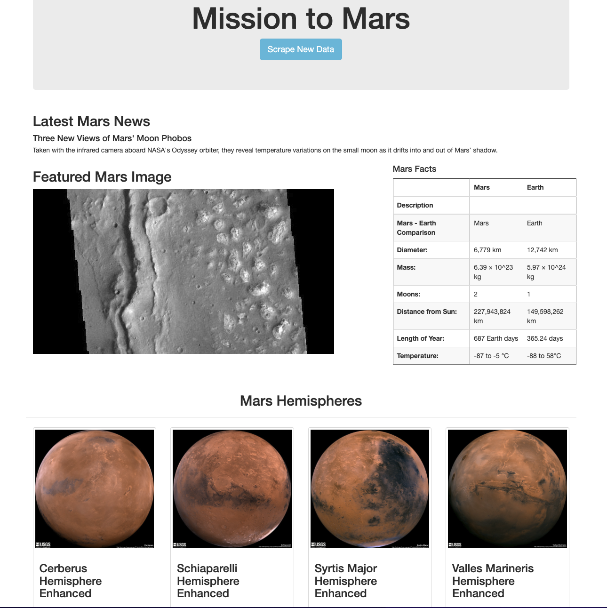

# Mission-to-mars

The purpose of this project is to use BeautifulSoup and Splinter to scrape full-resolution images of Mars’s hemispheres and the titles of those images, store the scraped data on a Mongo database, use a web application to display the data, and alter the design of the web app to accommodate these images.

## Results

This is how webpage looks like:
By clicking the Scrape new data button, the new news of the mars appear. By using beautifulSoup and splinter we have added images of the mar's hemisphere with the titles as can be seen in the picture.

## Summary

MongoDB database was used to store data from the web scrape, and then a web application was created with Flask to display the data from the web scrape. We have also used Bootstrap's grid system to create a responsive web app.
